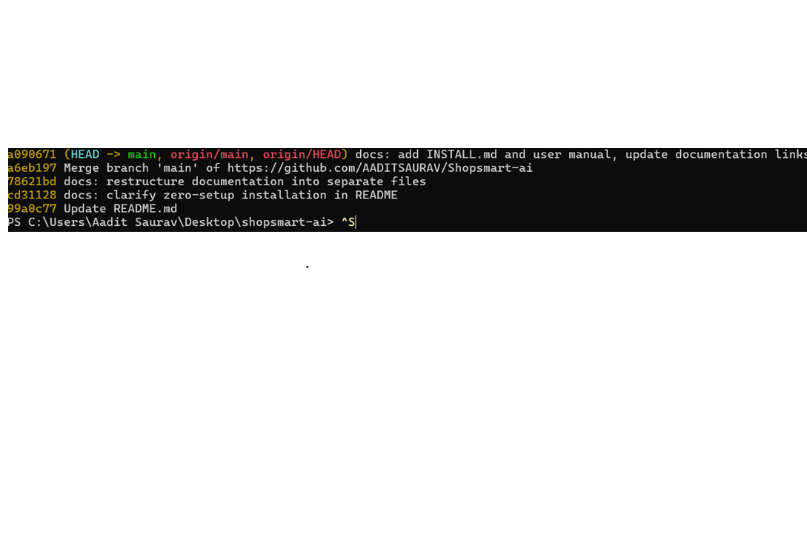
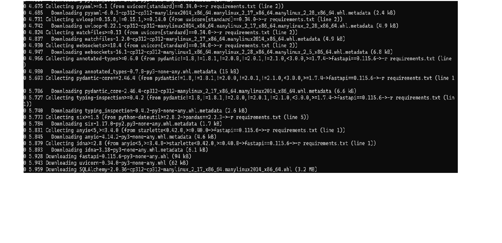
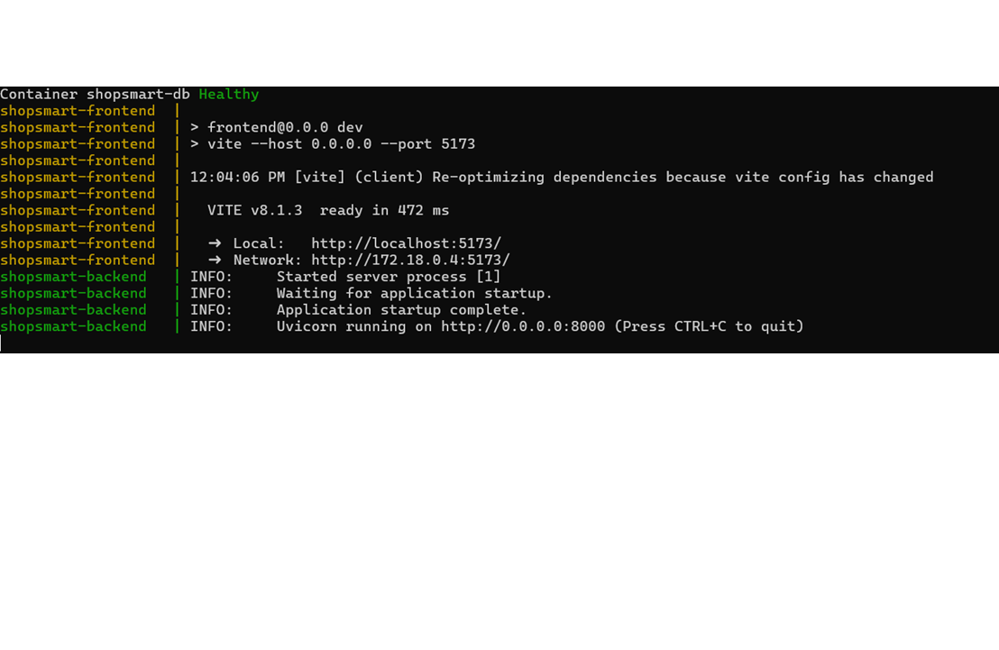
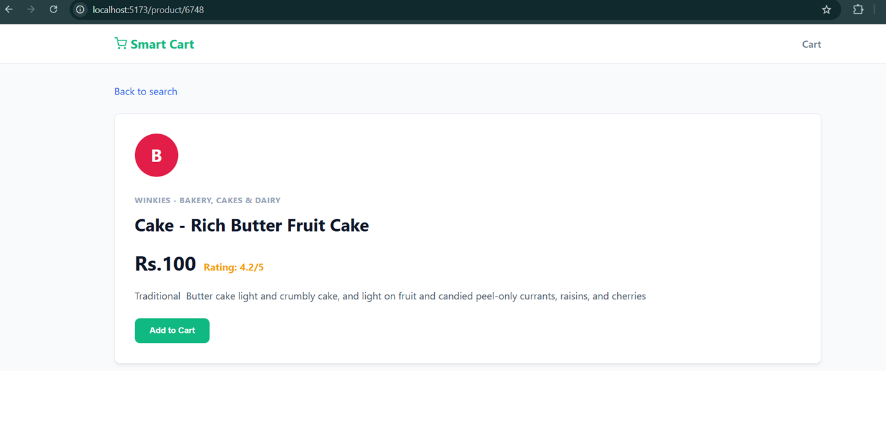

# Installation Guide

## Prerequisites

- Docker Desktop installed and running
- Git installed

## 1. Clone the repository

git clone https://github.com/AADITSAURAV/Shopsmart-ai.git
cd Shopsmart-ai

## 2. Run the project

docker compose up --build

This single command builds and starts all three services: the PostgreSQL database, the FastAPI backend, and the React frontend. On first run, the backend automatically creates the database schema and imports products, no manual setup is required.

By default the app loads a bundled sample dataset of about 70 products across all 11 categories. For the full catalog of over 27,000 products, download BigBasket Products.csv from Kaggle (see data/README.md) and place it at data/BigBasket Products.csv before running the command above. The backend automatically detects and prefers the full dataset when present.

## 3. Open the app

http://localhost:5173

## Troubleshooting

Docker will not start

docker compose down
docker compose up --build

Database connection error

Confirm the PostgreSQL container is running and that the backend only starts after PostgreSQL has passed its health check. Both are handled automatically by docker-compose.yml.

Results look sparse

If only around 70 results ever appear, the app is running on the bundled sample dataset rather than the full one. See step 2 above to add the full dataset.
